# ♟️ Chess Opening Trainer Pro

> Un logiciel de bureau (Python / PySide6) pour **travailler vos ouvertures
> d'échecs**, **affronter un bot qui joue de vraies variantes théoriques**,
> comprendre les idées derrière chaque coup, et **analyser vos parties après
> coup** — avec Stockfish en filet de sécurité.

<p align="center">
  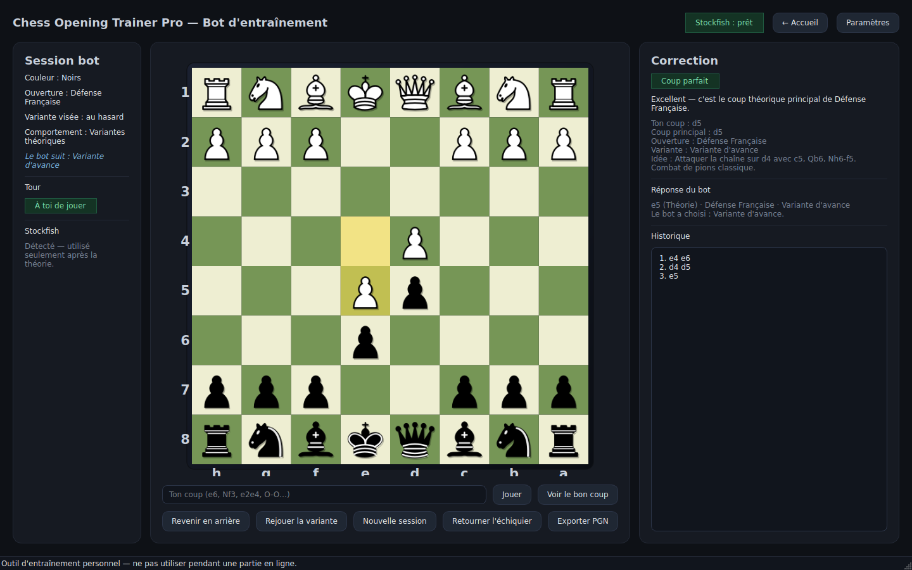
</p>

> ⚠️ **Fair-play — à lire**
> Cette application est un outil d'**entraînement personnel** et d'**analyse
> hors-ligne**. Elle **ne doit JAMAIS être utilisée pendant une partie** sur
> Chess.com, Lichess ou une autre plateforme : c'est de la triche et ça peut
> faire fermer votre compte. Utilisez-la pour **apprendre**, pas pour tricher.

---

## Sommaire

- [Aperçu visuel](#-aperçu-visuel)
- [Modes disponibles](#-modes-disponibles)
- [Mode Bot d'entraînement](#-mode-bot-dentraînement)
- [Ouvertures disponibles](#-ouvertures-disponibles)
- [Exemple d'utilisation](#-exemple-dutilisation)
- [Installation pas à pas](#-installation-pas-à-pas)
- [Installer Stockfish](#️-installer-stockfish-le-moteur)
- [Générer le `.exe` Windows](#️-générer-le-exe-windows)
- [Personnaliser `openings.json`](#-personnaliser-la-base-douvertures-openingsjson)
- [Problèmes fréquents](#-problèmes-fréquents)
- [Structure du projet](#-structure-du-projet)

---

## 🖼️ Aperçu visuel

### Écran d'accueil — on choisit le mode, la couleur, l'ouverture
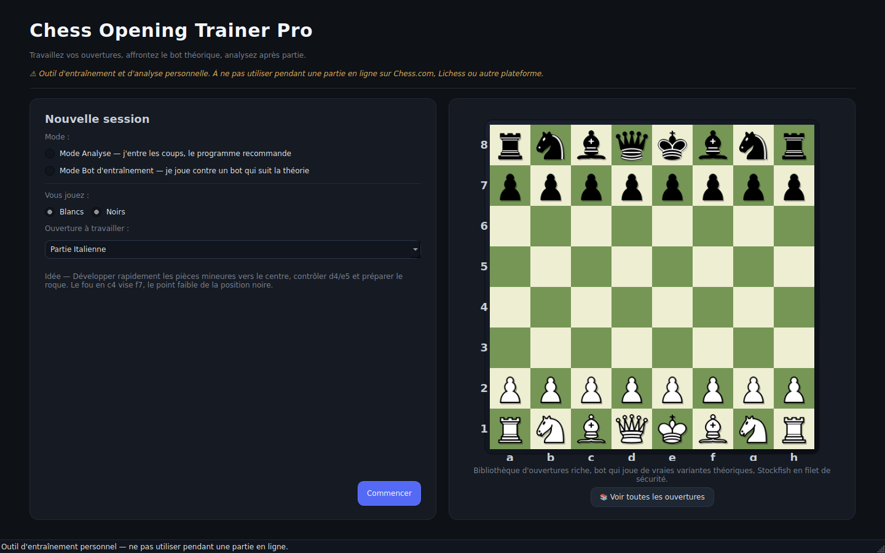

### Choix du mode Bot — variante visée + comportement du bot


### Mode Analyse — échiquier, coup recommandé, idée stratégique, historique
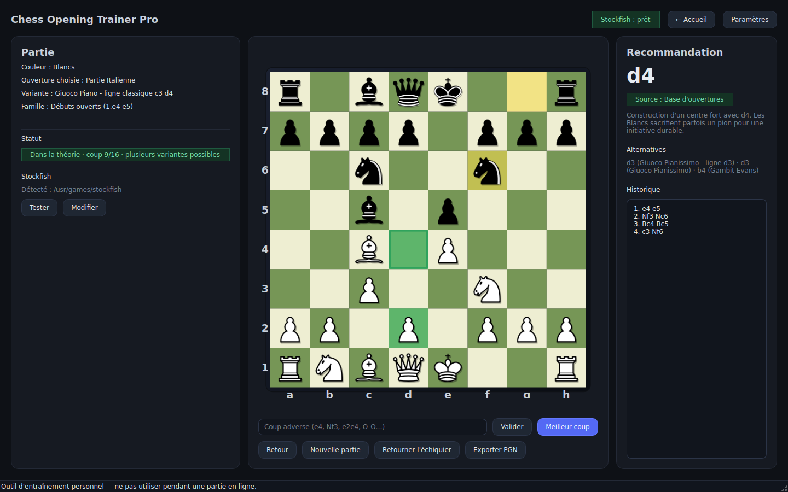

### Mode Analyse — détection automatique des transpositions
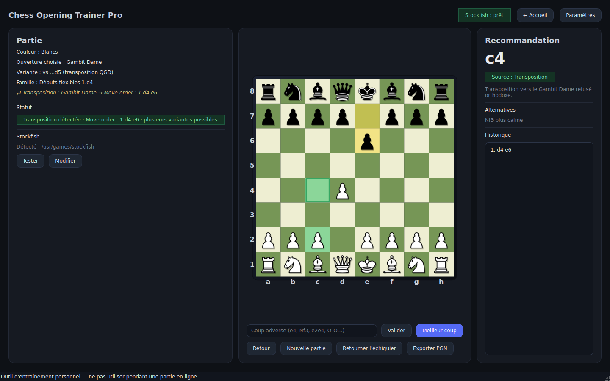

### Mode Analyse — Stockfish prend le relais une fois hors livre
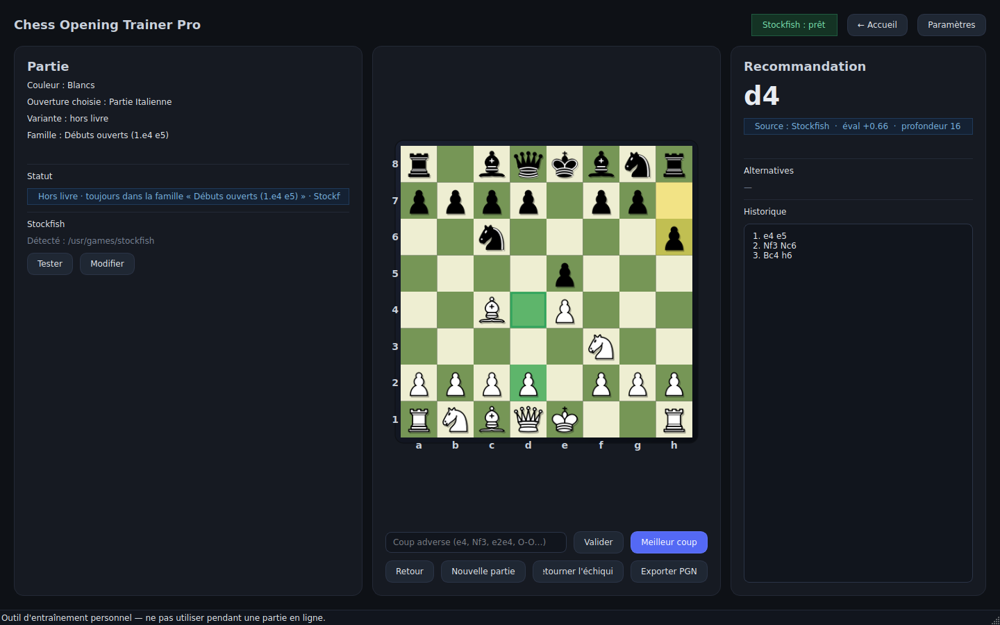

### Mode Bot — le bot suit une variante théorique, le joueur joue, l'app corrige


### Mode Bot — coup parfait
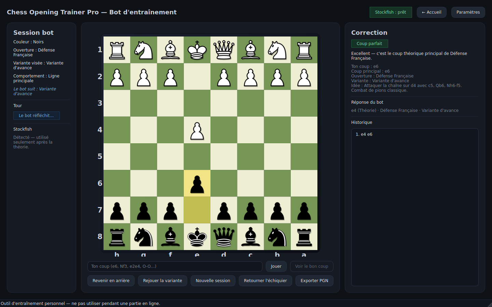

### Mode Bot — coup imprécis : l'app surligne le bon coup et propose Continuer / Annuler
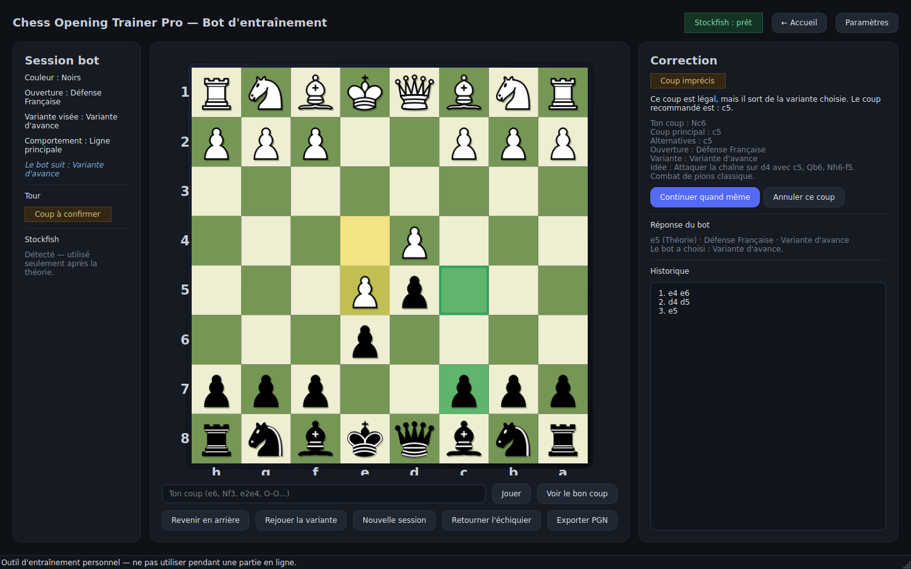

### Mode Bot — transposition : le joueur a quitté la Française pour une Sicilienne
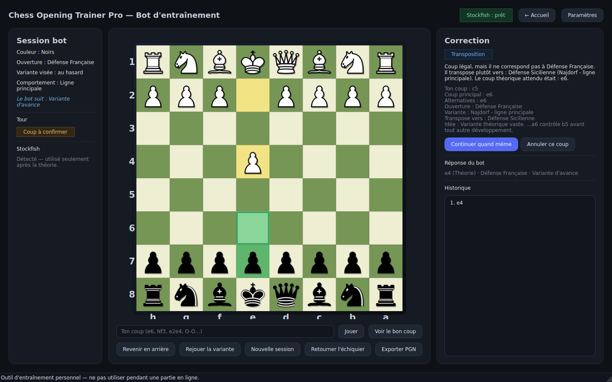

### Mode Bot — « Voir le bon coup »
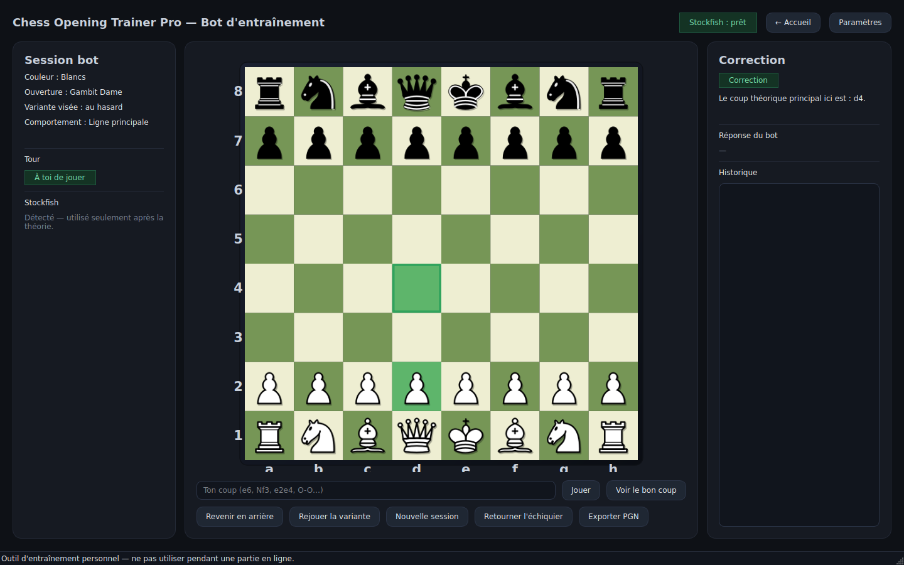

### Mode Bot — fin de la théorie : le bot continue avec Stockfish
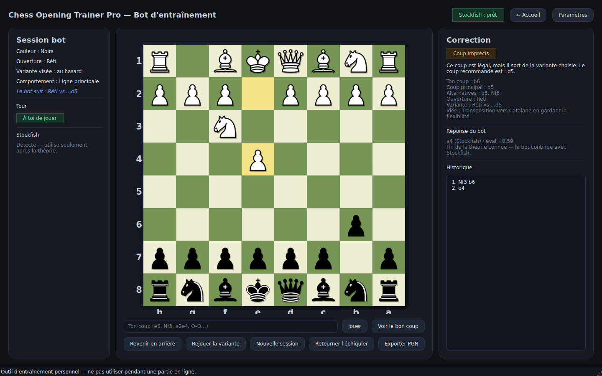

### Bibliothèque d'ouvertures intégrée (bouton « Voir toutes les ouvertures »)
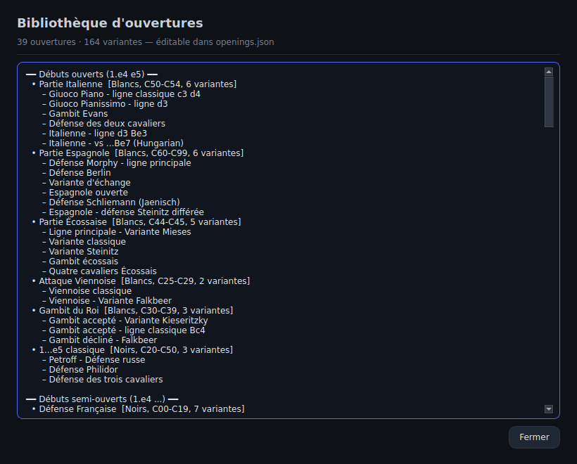

### Paramètres — chemin de Stockfish, profondeur, dossier PGN…
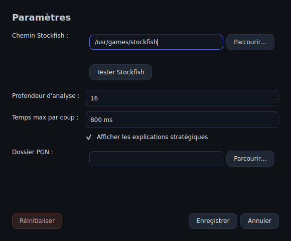

### Export PGN
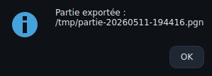

---

## 🎛️ Modes disponibles

| Mode | Ce que ça fait |
|---|---|
| **Mode Analyse** | Vous entrez **tous les coups** (les vôtres et ceux de l'adversaire). L'application affiche le **meilleur coup**, l'**idée stratégique**, les **alternatives**. Elle reconnaît les **transpositions** par position (FEN) et ne bascule sur **Stockfish** qu'une fois la théorie épuisée. Vous pouvez déplacer les pièces à la souris ou taper la notation (`e4`, `Nf3`, `O-O`, `e2e4`…). |
| **Mode Bot d'entraînement** | Vous jouez **contre un bot** qui joue le camp adverse en suivant la **théorie de l'ouverture choisie**. Le bot peut jouer la **ligne principale** ou **bifurquer vers d'autres variantes**. Après **chacun de vos coups**, l'application vous dit s'il est **parfait**, **alternatif**, **imprécis**, ou si vous avez **transposé** ailleurs — et vous montre le bon coup. Stockfish n'intervient qu'en **dernier recours**. |

---

## 🤖 Mode Bot d'entraînement

### Au démarrage

Sur l'écran d'accueil, choisissez :

- **Mode Bot d'entraînement** ;
- votre **couleur** (Blancs ou Noirs) ;
- l'**ouverture** à travailler ;
- la **variante** précise à viser, ou *« Au hasard — le bot choisit »* ;
- le **comportement du bot** :

  | Comportement | Effet |
  |---|---|
  | **Ligne principale** | Le bot reste sur la variante la plus classique. |
  | **Variantes théoriques** | Le bot choisit (et garde) une variante théorique parmi celles disponibles. |
  | **Aléatoire théorique** | Le bot pioche un coup théorique différent à chaque carrefour. |
  | **Mixte** | Majoritairement la ligne principale, parfois une variante (par défaut). |

→ cliquez sur **« Commencer contre le bot »**. Si le bot a les Blancs, il joue
1.e4 / 1.d4 / 1.c4 / 1.Cf3 tout seul.

### Pendant la partie — la correction de vos coups

À chaque fois que c'est votre tour, jouez votre coup (souris ou texte).
L'application le **note immédiatement** :

| Verdict | Message type | Ce qui se passe |
|---|---|---|
| 🟢 **Coup parfait** | *« Excellent — c'est le coup théorique principal de … »* | Le bot répond automatiquement. |
| 🟢 **Coup théorique alternatif** | *« Coup correct — c'est une variante théorique connue (…) »* | Le bot répond automatiquement. |
| 🟡 **Coup imprécis** | *« Ce coup est légal, mais il sort de la variante choisie. Le coup recommandé est : … »* | Le **bon coup est surligné** sur l'échiquier ; vous choisissez **« Continuer quand même »** ou **« Annuler ce coup »**. |
| 🔵 **Transposition** | *« Coup légal, mais il ne correspond pas à … . Il transpose plutôt vers : … (…). Le coup théorique attendu était : … »* | Idem : **Continuer** / **Annuler**. |
| 🟡 **Hors théorie** | *« Fin de la ligne théorique connue — tu peux continuer (Stockfish prend le relais) ou rejouer la variante. »* | Le bot continuera avec Stockfish si vous continuez. |
| 🔴 **Coup illégal** | *« Coup illégal — vérifie la notation ou la position. »* | Rien n'est joué. |

Le bot **annonce ses bifurcations** : *« Le bot a choisi : Variante d'avance. »*,
et la colonne de gauche affiche en permanence *« Le bot suit : … »*.

### Boutons du mode Bot

- **Voir le bon coup** — affiche/surligne le coup théorique principal sans le jouer.
- **Revenir en arrière** — annule votre dernier coup **et** celui du bot.
- **Rejouer la variante** — recommence la même session (même ouverture/variante/comportement).
- **Nouvelle session** — retour à l'écran d'accueil.
- **Retourner l'échiquier**, **Exporter PGN**, **Paramètres**.

### Stockfish = filet de sécurité uniquement

Le bot essaie, dans l'ordre :
1. la **variante cohérente** de l'ouverture choisie (suite littérale des coups) ;
2. sinon une **transposition reconnue** dans toute la base d'ouvertures ;
3. **et seulement après** : Stockfish.

---

## 📚 Ouvertures disponibles

`openings.json` contient actuellement **39 ouvertures** et **164 variantes**
(plus de **1500 positions reconnues** pour la détection des transpositions).
Vous pouvez l'éditer librement.

> Visuel : bouton **« Voir toutes les ouvertures »** sur l'écran d'accueil →
> 

### Pour les Blancs
- Partie Italienne · Partie Espagnole · Partie Écossaise · Attaque Viennoise · Gambit du Roi
- Gambit Dame · Système de Londres · Catalan · Trompowsky
- Ouverture Anglaise · Réti · Bird · Larsen-Nimzowitsch

### Pour les Noirs contre 1.e4
- Défense Française · Défense Caro-Kann · Défense Sicilienne · Défense Scandinave
- Défense Pirc · Défense Moderne · Défense Alekhine · Défense Owen · 1...e5 classique (Petroff, Philidor…)

### Pour les Noirs contre 1.d4
- Gambit Dame refusé · Défense Slave · Défense Semi-Slave
- Défense Indienne du Roi · Défense Nimzo-Indienne · Défense Ouest-Indienne · Défense Bogo-Indienne
- Défense Grünfeld · Défense Benoni moderne · Gambit Benko · Défense Hollandaise

### Entrées « ordre de coups » (transpositions)
Des entrées dédiées rattachent les ordres de coups courants à leurs familles :
`1.d4 e6`, `1.d4 Nf6`, `1.d4 d5`, `1.c4 …`, `1.Nf3 …`, `1.e4 …` (réponses minoritaires).

<details>
<summary><b>Tableau complet des ouvertures et variantes</b></summary>

### Débuts ouverts (1.e4 e5)

| Ouverture | Camp | ECO | Variantes |
|---|---|---|---|
| **Partie Italienne** | Blancs | C50-C54 | Giuoco Piano - ligne classique c3 d4 · Giuoco Pianissimo - ligne d3 · Gambit Evans · Défense des deux cavaliers · Italienne - ligne d3 Be3 · Italienne - vs ...Be7 (Hungarian) |
| **Partie Espagnole** | Blancs | C60-C99 | Défense Morphy - ligne principale · Défense Berlin · Variante d'échange · Espagnole ouverte · Défense Schliemann (Jaenisch) · Espagnole - défense Steinitz différée |
| **Partie Écossaise** | Blancs | C44-C45 | Ligne principale - Variante Mieses · Variante classique · Variante Steinitz · Gambit écossais · Quatre cavaliers Écossais |
| **Attaque Viennoise** | Blancs | C25-C29 | Viennoise classique · Viennoise - Variante Falkbeer |
| **Gambit du Roi** | Blancs | C30-C39 | Gambit accepté - Variante Kieseritzky · Gambit accepté - ligne classique Bc4 · Gambit décliné - Falkbeer |
| **1...e5 classique** | Noirs | C20-C50 | Petroff - Défense russe · Défense Philidor · Défense des trois cavaliers |

### Débuts semi-ouverts (1.e4 …)

| Ouverture | Camp | ECO | Variantes |
|---|---|---|---|
| **Défense Française** | Noirs | C00-C19 | Variante d'avance · Variante d'échange · Variante Tarrasch · Variante Winawer · Variante classique · Variante Rubinstein · Française - Roi roi (Système du Roi) |
| **Défense Caro-Kann** | Noirs | B10-B19 | Variante classique · Variante d'avance · Variante d'échange · Attaque Panov-Botvinnik · Variante des deux cavaliers · Variante Bronstein-Larsen |
| **Défense Sicilienne** | Noirs | B20-B99 | Najdorf - ligne principale · Variante Dragon · Variante Scheveningue · Variante classique · Variante Alapine · Grand Prix Attack · Sicilienne fermée · Sicilienne accélérée Dragon · Anti-Sicilienne Rossolimo · Anti-Sicilienne Moscou |
| **Défense Scandinave** | Noirs | B01 | Variante principale Qa5 · Scandinave moderne Nf6 · Scandinave Qd6 |
| **Défense Pirc** | Noirs | B07-B09 | Pirc - système classique · Attaque autrichienne · Pirc - 150 attack |
| **Défense Moderne** | Noirs | B06 | Moderne classique · Moderne - Averbakh · Moderne contre 1.d4 |
| **Défense Alekhine** | Noirs | B02-B05 | Alekhine - Variante des quatre pions · Alekhine - Variante moderne · Alekhine - Variante d'échange |
| **Défense Owen** | Noirs | B00 | Owen vs 1.e4 · Owen vs 1.d4 (English Defence) |
| **Move-order : 1.e4 réponses minoritaires** | Blancs | B00 | vs 1...Nc6 (Nimzowitsch) · vs 1...a6 (St. George) · vs 1...b6 (Owen direct) |

### Débuts fermés (1.d4 d5)

| Ouverture | Camp | ECO | Variantes |
|---|---|---|---|
| **Gambit Dame** | Blancs | D06-D69 | Gambit Dame refusé - Défense orthodoxe · Gambit Dame accepté - ligne principale · Gambit Dame - Variante d'échange · Catalane fermée · Catalane ouverte · Système Colle (transposable) · GD - Défense Tchigorine |
| **Système de Londres** | Blancs | D02-A48 | Londres classique contre d5 · Londres contre Cf6 (Est-Indienne) · Londres avec c4 (style Kapengut) · Londres - défense ...c5 ...Qb6 · Londres avec e3, Bd3, Nbd2 · Londres vs ...Bf5 (Kar-style) |
| **Gambit Dame refusé (Noirs)** | Noirs | D30-D69 | Défense orthodoxe · Variante Tartakower · Défense Lasker · Variante Cambridge Springs · QGD - Tarrasch |
| **Défense Slave** | Noirs | D10-D19 | Slave - ligne principale · Slave - Variante d'échange · Variante Chebanenko |
| **Défense Semi-Slave** | Noirs | D43-D49 | Variante Meran · Variante Botvinnik |
| **Catalan** | Blancs | E01-E09 | Catalan ouvert classique · Catalan fermé classique · Catalan vs 4...Bb4+ |
| **Move-order : 1.d4 d5** | Blancs | D00-D05 | vs ...e6 (QGD) · vs ...c6 (Slave) · vs ...dxc4 (QGA) · vs ...Nc6 (Tchigorine) · vs ...Nf6 (Marshall) · vs ...Bf5 (Baltic) |

### Défenses indiennes (1.d4 Cf6)

| Ouverture | Camp | ECO | Variantes |
|---|---|---|---|
| **Défense Indienne du Roi** | Noirs | E60-E99 | Ligne principale classique · Variante Sämisch · Variante Fianchetto · Four Pawns Attack · Variante Averbakh |
| **Défense Nimzo-Indienne** | Noirs | E20-E59 | Variante Rubinstein · Variante Capablanca (Qc2) · Variante Sämisch · Nimzo - Variante Leningrad |
| **Défense Ouest-Indienne** | Noirs | E12-E19 | Ligne principale · Variante Petrosian |
| **Défense Bogo-Indienne** | Noirs | E11 | Bogo - ligne principale Bd2 · Bogo - Bxd2+ · Bogo - 4.Nbd2 |
| **Défense Grünfeld** | Noirs | D70-D99 | Variante d'échange · Variante russe · Variante Bf4 · Grünfeld - g3 (Stockholm) |
| **Défense Benoni moderne** | Noirs | A60-A79 | Benoni moderne - ligne principale · Benoni - Variante Tal (4.f4) · Old Benoni |
| **Gambit Benko** | Noirs | A57-A59 | Benko accepté · Benko décliné - 4.a4 |
| **Trompowsky** | Blancs | A45 | Trompowsky - ligne principale · Trompowsky - 2...e6 · Trompowsky - 2...c5 |
| **Move-order : 1.d4 Nf6** | Blancs | A45-A50 | vs ...g6 (transposition KID/Grünfeld) · vs ...e6 (Indien e6) · vs ...c5 (Benoni) · vs ...d5 (Grünfeld direct) · vs ...d6 (Old Indian) |

### Débuts flexibles 1.d4

| Ouverture | Camp | ECO | Variantes |
|---|---|---|---|
| **Défense Hollandaise** | Noirs | A80-A99 | Variante Leningrad · Variante classique · Stonewall · Hollandaise - Anti-1.c4 |
| **Move-order : 1.d4 e6** | Blancs | A40 | vs ...d5 (transposition QGD) · vs ...Nf6 (transposition Nimzo) · vs ...Nf6 (transposition Bogo) · vs ...f5 (Hollandaise) · vs ...b6 (English Defence) |

### Anglaise (1.c4)

| Ouverture | Camp | ECO | Variantes |
|---|---|---|---|
| **Ouverture Anglaise** | Blancs | A10-A39 | Anglaise symétrique · Anglaise - Variante inversée Sicilienne · Anglaise - Système Botvinnik · Anglaise - Quatre cavaliers · Anglaise vs 1...e6 (Mikenas) · Anglaise vs 1...Nf6 (Anti-Indien) · Anglaise vs 1...g6 |
| **Move-order : 1.c4 réponses** | Blancs | A10-A39 | vs 1...c5 (Anglaise symétrique) · vs 1...e5 (Sicilienne inversée) · vs 1...Nf6 (Indien) · vs 1...e6 (Mikenas) · vs 1...g6 · vs 1...c6 (Caro-Kann inversée) · vs 1...f5 (Hollandaise inversée) |

### Réti (1.Cf3)

| Ouverture | Camp | ECO | Variantes |
|---|---|---|---|
| **Réti** | Blancs | A04-A09 | Réti vs ...d5 · Réti - système Nf3-c4-b3 · Réti vs ...Nf6 · Réti vs Roi-Indien renversé |
| **Move-order : 1.Nf3 réponses** | Blancs | A04-A09 | vs 1...d5 · vs 1...Nf6 · vs 1...c5 · vs 1...e6 · vs 1...g6 |

### Ouvertures de flanc

| Ouverture | Camp | ECO | Variantes |
|---|---|---|---|
| **Bird** | Blancs | A02-A03 | Bird - ligne principale · Gambit From |
| **Larsen-Nimzowitsch** | Blancs | A01 | Larsen vs ...e5 · Larsen vs ...d5 |
</details>

---

## ▶️ Exemple d'utilisation

**Mode Bot — Noirs + Défense Française, comportement « Variantes théoriques »**

```
Bot   : 1. e4
Vous  : 1...e6     → "Excellent — c'est le coup théorique principal de la Défense Française."
Bot   : 2. d4
Vous  : 2...d5     → "Coup parfait."
Bot   : 3. e5      → "Le bot a choisi : Variante d'avance."   (Le bot suit : Variante d'avance)
Vous  : 3...c5     → "Coup parfait."
Bot   : 4. c3
...

Si à la place vous jouez 3...Nc6 :
Vous  : 3...Nc6    → 🟡 "Ce coup est légal, mais il sort de la variante choisie.
                        Le coup recommandé est : c5."        [Continuer quand même] [Annuler ce coup]
                     (le coup c5 est surligné en vert sur l'échiquier)

Si vous jouez 1...c5 au coup 1 :
Vous  : 1...c5     → 🔵 "Coup légal, mais il ne correspond pas à Défense Française.
                        Il transpose plutôt vers : Défense Sicilienne (Najdorf - ligne principale).
                        Le coup théorique attendu était : e6."  [Continuer quand même] [Annuler ce coup]
```

**Mode Analyse — Blancs + Partie Italienne**

```
Vous validez les coups noirs ; l'app recommande les vôtres :
1.e4 e5 2.Nf3 Nc6 3.Bc4 Bc5 4.c3 Nf6  → recommandé : d4
  Source : Base d'ouvertures · Variante : Giuoco Piano - ligne classique c3 d4
  Idée : construire un centre fort avec d4...
Si le noir sort du livre (ex. 3...h6) :
  → recommandé : d4 · Source : Stockfish · éval +0.66 · profondeur 16
  Statut : "Hors livre · toujours dans la famille « Débuts ouverts (1.e4 e5) »"
```

---

## 🚀 Installation pas à pas

> Ce guide suppose que vous **n'y connaissez rien**. Suivez les étapes dans
> l'ordre, sans en sauter.

### Méthode A — Lancer avec Python (pour tester rapidement)

**Étape 1 — Installer Python**
1. Allez sur **https://www.python.org/downloads/** et cliquez sur **« Download Python 3.x »**.
2. Lancez le fichier téléchargé.
3. **TRÈS IMPORTANT** : sur le premier écran, **cochez « Add Python to PATH »** (tout en bas), puis « Install Now ». Si vous oubliez cette case, rien ne marchera ensuite.

**Étape 2 — Télécharger l'application**
1. Sur la page GitHub du projet, bouton vert **« Code »** → **« Download ZIP »**.
2. Décompressez le ZIP (par ex. sur le Bureau) → dossier `chess-opening-trainer-pro`.

**Étape 3 — Ouvrir un terminal dans ce dossier**
- **Windows** : ouvrez le dossier, cliquez dans la barre d'adresse de l'explorateur, tapez `cmd`, Entrée.
- **Mac** : ouvrez « Terminal », tapez `cd ` (avec un espace) puis glissez-déposez le dossier, Entrée.

**Étape 4 — Installer les dépendances (une seule fois)**
```bash
pip install -r requirements.txt
```

**Étape 5 — Lancer l'application**
```bash
python main.py
```

> Pour relancer plus tard : refaites l'étape 3 puis l'étape 5.

### Méthode B — Avoir un vrai `.exe` Windows

1. Faites les étapes 1, 2 et 3 de la Méthode A.
2. Dans le dossier, **double-cliquez sur `build_exe.bat`** (il installe ce qu'il faut et fabrique le `.exe`, 3-5 min).
3. Allez dans `dist\chess_opening_trainer_pro\` et lancez **`chess_opening_trainer_pro.exe`**.

> Vous pouvez copier ce dossier où vous voulez (Documents, clé USB…). Si Windows
> Defender avertit : « Informations complémentaires » → « Exécuter quand même ».

---

## ♟️ Installer Stockfish (le moteur)

L'application **fonctionne déjà sans Stockfish** (toute la partie « ouvertures »
marche). Stockfish ne sert qu'à calculer le coup une fois la théorie épuisée.

### Windows
1. Allez sur **https://stockfishchess.org/download/**, section **Windows**, téléchargez le `.zip`.
2. **Décompressez-le** (clic droit → « Extraire tout… »).
3. Dedans, trouvez le fichier qui finit par `.exe` et **renommez-le `stockfish.exe`**.
4. Créez un dossier `C:\Stockfish\` et **mettez `stockfish.exe` dedans** → vous aurez `C:\Stockfish\stockfish.exe`.
5. C'est tout : l'application le détecte automatiquement au lancement.

### Mac
```bash
brew install stockfish      # nécessite Homebrew : https://brew.sh
```

### Linux
```bash
sudo apt install stockfish  # Debian / Ubuntu  (binaire : /usr/games/stockfish)
sudo dnf install stockfish  # Fedora
```

### Vérifier
Dans un terminal : tapez `stockfish` (ou `C:\Stockfish\stockfish.exe`). Si vous
voyez `Stockfish 16 by the Stockfish developers`, c'est bon — tapez `quit`.

### Configurer le chemin à la main
Dans l'app : **Paramètres** → **Parcourir…** → choisissez votre `stockfish.exe` →
**Tester Stockfish** (message vert) → **Enregistrer**. Le chemin est mémorisé
dans `config.json` (chemins testés automatiquement : `stockfish` dans le PATH,
`C:\Stockfish\…`, `C:\Program Files\Stockfish\…`, `/usr/local/bin/stockfish`,
`/opt/homebrew/bin/stockfish`, `/usr/bin/stockfish`, `/usr/games/stockfish`).

---

## 🛠️ Générer le `.exe` Windows

Double-clic sur `build_exe.bat`, ou manuellement :
```bash
pip install pyinstaller
pyinstaller --noconfirm --clean --windowed ^
    --name chess_opening_trainer_pro ^
    --add-data "openings.json;." ^
    --add-data "config.json;." ^
    --add-data "assets;assets" ^
    main.py
```
L'exécutable est dans `dist/chess_opening_trainer_pro/`. Sous Linux/macOS,
remplacez `;` par `:` dans `--add-data`. Pour un seul fichier : ajoutez `--onefile`.

---

## 📝 Personnaliser la base d'ouvertures (`openings.json`)

```json
{
  "name": "Mon ouverture",
  "color": "white",
  "family": "open_games",
  "eco": "C50",
  "idea": "Une phrase qui explique l'idée générale.",
  "variations": [
    {
      "name": "Ma variante",
      "moves": ["e4", "e5", "Nf3", "Nc6", "Bc4", "Bc5"],
      "idea": "L'idée de cette variante précise.",
      "alternatives": ["d3 plus calme", "b4 Gambit Evans"]
    }
  ]
}
```
- `color` : `"white"` ou `"black"` (filtre du menu).
- `family` : `open_games`, `semi_open`, `closed_games`, `indian`, `flexible_d4`, `english`, `reti`, `flank`, ou `other`.
- `moves` : notation **SAN** (`e4`, `Nf3`, `O-O`, `Bxc6`…). Une faute fait ignorer la variante fautive.

Ajouter une variante à une ouverture existante = ajouter un objet dans son tableau `variations`.

---

## ❓ Problèmes fréquents

| Symptôme | Solution |
|---|---|
| `'python' n'est pas reconnu...` | Vous avez oublié « Add Python to PATH » à l'installation. Réinstallez en cochant la case. |
| `ModuleNotFoundError: PySide6` | `pip install -r requirements.txt` (étape 4). |
| « Stockfish : non configuré » | Normal sans Stockfish ; l'app marche quand même. Pour l'ajouter : section Stockfish. |
| L'app ne trouve pas Stockfish | Paramètres → Parcourir → `stockfish.exe` → Tester → Enregistrer. |
| « Coup illégal ou notation invalide » | Vérifiez la notation : `Nf3`, `Bb5`, `O-O`, `e4`, `e2e4`. |
| Le `.exe` ne se lance pas / antivirus | « Informations complémentaires » → « Exécuter quand même », ou exception antivirus. |
| Sous Linux : `libEGL.so.1 manquant` | `sudo apt install libegl1 libgl1`. |

---

## 🧱 Structure du projet

```
chess-opening-trainer-pro/
├── main.py                # lancement de l'application
├── requirements.txt       # dépendances Python (PySide6, python-chess)
├── README.md
├── config.json            # vos réglages (créé/mis à jour automatiquement)
├── openings.json          # la base d'ouvertures (éditable)
├── build_exe.bat          # script pour fabriquer le .exe Windows
├── app/
│   ├── ui.py              # interface : accueil, mode Analyse, mode Bot, bibliothèque, paramètres
│   ├── board_widget.py    # l'échiquier (pièces SVG, drag & drop, surlignages, verrou d'input)
│   ├── engine.py          # détection et pilotage de Stockfish (UCI)
│   ├── opening_book.py    # chargement + indexation des ouvertures par position (FEN)
│   ├── game_manager.py    # logique du mode Analyse + recommandations
│   ├── training_bot.py    # le bot théorique + évaluation pédagogique des coups (mode Bot)
│   ├── settings.py        # lecture/écriture de config.json
│   └── utils.py
├── assets/                # icônes / pièces / styles (réservé)
└── docs/
    └── screenshots/       # captures utilisées dans ce README
```

---

## 🔐 Rappel fair-play

Ce logiciel sert à **apprendre, comprendre et progresser aux échecs**. L'utiliser
pendant une partie en ligne est de la triche, viole les règles de toutes les
plateformes, et gâche le jeu. Entraînez-vous avec, jouez sans. Bonne progression ! ♟️
