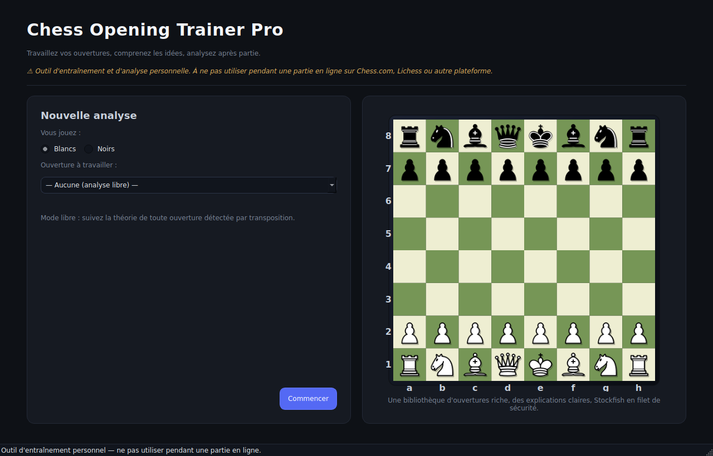
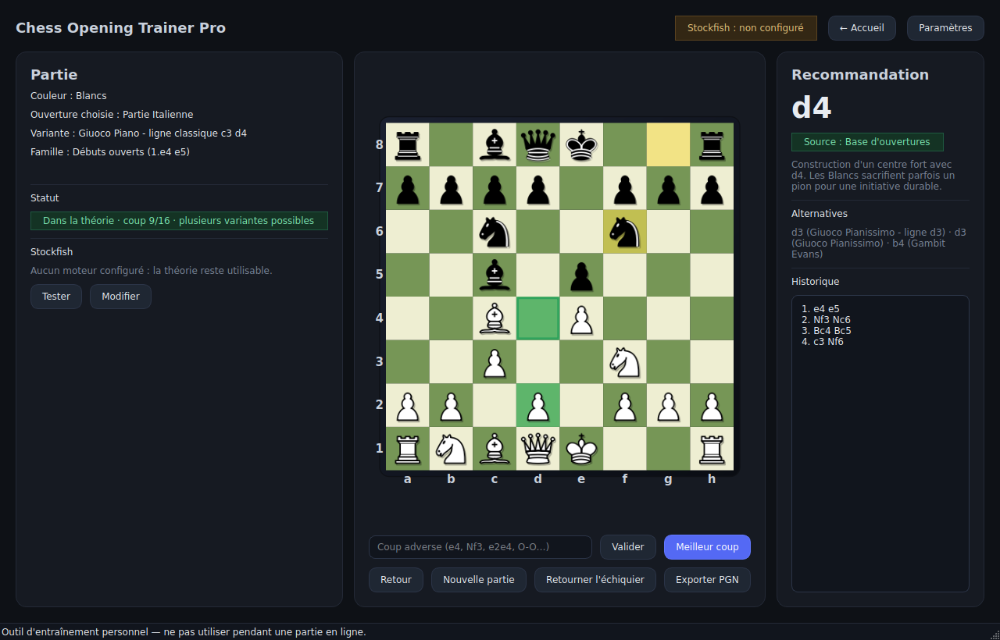
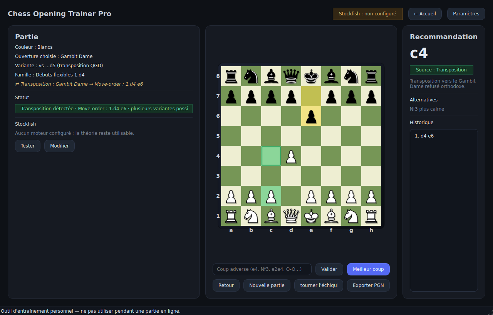
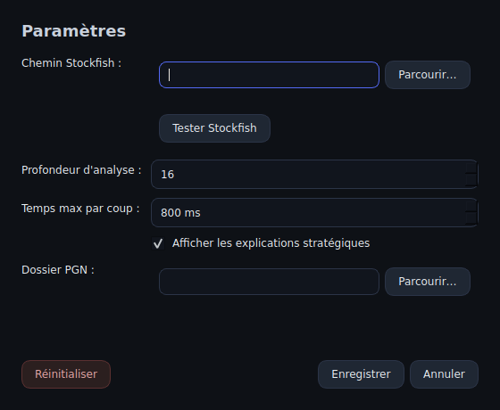

# ♟️ Chess Opening Trainer Pro

Un logiciel de bureau pour **travailler vos ouvertures d'échecs**, comprendre les
idées derrière chaque coup, et **analyser vos parties après coup**.

> ⚠️ **Important — fair-play**
> Cette application est un outil d'**entraînement personnel** et d'**analyse
> hors-ligne**. Elle **ne doit JAMAIS être utilisée pendant une partie** sur
> Chess.com, Lichess ou une autre plateforme. C'est de la triche, et ça peut
> faire fermer votre compte. Utilisez-la pour **apprendre**, pas pour tricher.

---

## 📸 À quoi ça ressemble

### Écran d'accueil — vous choisissez votre couleur et votre ouverture


### Écran principal — échiquier, coup recommandé, idée stratégique, historique


### Détection automatique des transpositions
Si votre adversaire joue les coups dans un ordre différent, l'application
reconnaît quand même la position et vous dit vers quelle ouverture vous
avez transposé :


### Fenêtre Paramètres — chemin de Stockfish, profondeur, etc.


---

## 🚀 Comment installer et lancer l'application (étape par étape)

> Ce guide suppose que vous **n'y connaissez rien**. Suivez les étapes dans
> l'ordre, sans en sauter.

### Méthode A — Lancer avec Python (pour tester rapidement)

#### Étape 1 — Installer Python
1. Allez sur **https://www.python.org/downloads/**
2. Cliquez sur le gros bouton **"Download Python 3.x.x"**
3. Lancez le fichier téléchargé.
4. **TRÈS IMPORTANT** : sur le premier écran de l'installateur, **cochez la
   case "Add Python to PATH"** (tout en bas), PUIS cliquez sur "Install Now".
   Si vous oubliez cette case, rien ne marchera ensuite.
5. Attendez la fin, cliquez sur "Close".

#### Étape 2 — Télécharger l'application
1. Allez sur la page GitHub du projet.
2. Cliquez sur le bouton vert **"Code"** → **"Download ZIP"**.
3. Décompressez le ZIP quelque part (par exemple sur le Bureau).
   Vous obtenez un dossier `chess-opening-trainer-pro`.

#### Étape 3 — Ouvrir un terminal dans ce dossier
- **Windows** : ouvrez le dossier `chess-opening-trainer-pro`, cliquez dans la
  barre d'adresse en haut de l'explorateur, tapez `cmd` et appuyez sur Entrée.
  Une fenêtre noire s'ouvre — c'est le terminal.
- **Mac** : ouvrez l'app "Terminal", tapez `cd ` (avec un espace), puis
  glissez-déposez le dossier dans la fenêtre, appuyez sur Entrée.

#### Étape 4 — Installer les dépendances (une seule fois)
Dans le terminal, tapez exactement :
```bash
pip install -r requirements.txt
```
Appuyez sur Entrée. Attendez que ça finisse (1-2 minutes).

#### Étape 5 — Lancer l'application
Toujours dans le terminal :
```bash
python main.py
```
La fenêtre de l'application s'ouvre. 🎉

> Pour relancer l'app plus tard : il suffit de refaire l'**étape 3** puis
> l'**étape 5** (pas besoin de réinstaller).

---

### Méthode B — Avoir un vrai `.exe` Windows (double-clic, comme un vrai logiciel)

> Cette méthode demande de faire le "build" **une fois** sur un PC Windows.
> Ensuite vous avez un `.exe` que vous pouvez lancer d'un double-clic, copier
> sur une clé USB, etc.

1. Faites d'abord les **étapes 1, 2 et 3** de la Méthode A ci-dessus.
2. Dans le dossier, **double-cliquez sur le fichier `build_exe.bat`**.
3. Une fenêtre noire s'ouvre et travaille toute seule pendant 3 à 5 minutes
   (elle installe ce qu'il faut et fabrique le `.exe`).
4. Quand c'est fini, allez dans le dossier
   `dist\chess_opening_trainer_pro\` qui a été créé.
5. Lancez **`chess_opening_trainer_pro.exe`** d'un double-clic.

> Vous pouvez copier tout le dossier `dist\chess_opening_trainer_pro\` où vous
> voulez (Documents, Bureau, clé USB…). Tant que vous gardez le dossier
> entier, le `.exe` marche.

**Note antivirus** : Windows Defender ou votre antivirus peut afficher un
avertissement la première fois (c'est normal pour les `.exe` créés avec
PyInstaller). Cliquez sur "Informations complémentaires" → "Exécuter quand
même", ou ajoutez une exception.

---

## ♟️ Installer Stockfish (le moteur d'échecs) — étape par étape

Stockfish est un programme **séparé** qui calcule le meilleur coup quand on sort
de la théorie d'ouverture. **L'application marche déjà sans Stockfish** (toute la
partie "ouvertures" fonctionne), mais c'est mieux de l'installer.

### Sur Windows

1. Allez sur **https://stockfishchess.org/download/**
2. Sous **"Windows"**, téléchargez la version proposée (un fichier `.zip`,
   souvent appelé quelque chose comme `stockfish-windows-x86-64-avx2.zip`).
3. **Décompressez le `.zip`** (clic droit → "Extraire tout…").
4. À l'intérieur, vous trouverez un fichier qui se termine par `.exe`
   (par exemple `stockfish-windows-x86-64-avx2.exe`).
5. **Renommez ce fichier en `stockfish.exe`** (clic droit → Renommer).
6. **Déplacez `stockfish.exe`** dans un dossier facile à retrouver. Le plus
   simple : créez un dossier `C:\Stockfish\` et mettez `stockfish.exe` dedans.
   → vous aurez donc `C:\Stockfish\stockfish.exe`.
7. C'est tout. Quand vous lancerez l'application, elle le trouvera toute seule.

> Si vous l'avez mis ailleurs et qu'elle ne le trouve pas : voir
> "Configurer le chemin manuellement" plus bas.

### Sur Mac

Le plus simple est d'utiliser **Homebrew** :
1. Ouvrez l'app "Terminal".
2. Si vous n'avez pas Homebrew, installez-le en collant cette commande
   (depuis https://brew.sh) :
   ```bash
   /bin/bash -c "$(curl -fsSL https://raw.githubusercontent.com/Homebrew/install/HEAD/install.sh)"
   ```
3. Puis installez Stockfish :
   ```bash
   brew install stockfish
   ```
4. C'est fini. L'application le détectera automatiquement.

### Sur Linux

```bash
sudo apt install stockfish        # Debian / Ubuntu
sudo dnf install stockfish        # Fedora
```
Détection automatique ensuite.

### Vérifier que Stockfish est bien installé

Ouvrez un terminal et tapez :
```bash
stockfish
```
Si vous voyez quelque chose comme `Stockfish 16 by the Stockfish developers`,
c'est bon. Tapez `quit` et Entrée pour sortir.

(Sur Windows, si vous avez mis le fichier dans `C:\Stockfish\`, tapez plutôt
`C:\Stockfish\stockfish.exe` pour le test.)

### Si l'application ne trouve pas Stockfish toute seule

1. Dans l'application, cliquez sur le bouton **"Paramètres"** (en haut à droite).
2. À côté de **"Chemin Stockfish"**, cliquez sur **"Parcourir…"**.
3. Allez chercher votre fichier `stockfish.exe` (ou `stockfish` sur Mac/Linux)
   et sélectionnez-le.
4. Cliquez sur **"Tester Stockfish"** : un message vert "Connecté à Stockfish…"
   doit apparaître.
5. Cliquez sur **"Enregistrer"**. Le chemin est mémorisé, vous n'aurez plus à
   le refaire.

---

## 🎮 Comment se servir de l'application

1. **Au lancement**, sur l'écran d'accueil :
   - choisissez si **vous jouez les Blancs ou les Noirs** ;
   - choisissez **l'ouverture** que vous voulez travailler (ou "Aucune" pour
     un mode libre) ;
   - cliquez sur **"Commencer"**.

2. **Sur l'écran principal** :
   - quand **c'est à vous de jouer**, l'application affiche le **coup
     recommandé** (en gros à droite), avec l'**idée stratégique** et les
     **alternatives** ;
   - quand **c'est à votre adversaire de jouer**, entrez son coup :
     - soit en l'**écrivant** dans le champ en bas (`e4`, `Nf3`, `O-O`, ou
       même `e2e4`), puis "Valider" ;
     - soit en **déplaçant directement la pièce de l'adversaire avec la
       souris** sur l'échiquier.

3. **Boutons utiles** :
   - **"Meilleur coup"** : joue automatiquement le coup recommandé pour vous.
   - **"Retour"** : annule le dernier coup.
   - **"Nouvelle partie"** : revient à l'écran d'accueil.
   - **"Retourner l'échiquier"** : change l'orientation.
   - **"Exporter PGN"** : sauvegarde la partie dans un fichier `.pgn`.
   - **"Paramètres"** : règle Stockfish, la profondeur d'analyse, le dossier
     d'export, etc.

4. **Statuts affichés** :
   - **"Dans la théorie · coup X/Y"** → vous suivez une ligne connue.
   - **"Transposition détectée · …"** → l'adversaire a changé l'ordre des
     coups mais la position correspond à une autre ouverture connue.
   - **"Hors livre · toujours dans la famille …"** → on sort de la théorie
     exacte, Stockfish prend le relais mais on reste dans la même famille.
   - **"Sortie de théorie · analyse Stockfish"** → Stockfish calcule le coup.
   - **"Coup illégal ou notation invalide"** → vous avez mal saisi un coup.

---

## 📚 Personnaliser la base d'ouvertures (`openings.json`)

Le fichier `openings.json` contient **39 ouvertures** et **164 variantes**
(plus de 1500 positions reconnues). Vous pouvez l'éditer avec n'importe quel
éditeur de texte (Bloc-notes, etc.).

### Ajouter une ouverture

Ajoutez un bloc dans la liste `"openings"` :
```json
{
  "name": "Mon ouverture",
  "color": "white",
  "family": "open_games",
  "eco": "C50",
  "idea": "Une phrase qui explique l'idée générale.",
  "variations": [
    {
      "name": "Ma variante",
      "moves": ["e4", "e5", "Nf3", "Nc6", "Bc4", "Bc5"],
      "idea": "L'idée de cette variante précise.",
      "alternatives": ["d3 plus calme", "b4 Gambit Evans"]
    }
  ]
}
```
- `color` : `"white"` ou `"black"` (juste pour le filtre du menu).
- `family` : une de `open_games`, `semi_open`, `closed_games`, `indian`,
  `flexible_d4`, `english`, `reti`, `flank` (ou `other`).
- `moves` : les coups en **notation algébrique standard** (SAN), comme `e4`,
  `Nf3`, `O-O`, `Bxc6`…

### Ajouter une variante à une ouverture existante

Ajoutez simplement un nouvel objet dans le tableau `variations` de l'ouverture
concernée.

> ⚠️ Si vous faites une faute (coup illégal, virgule en trop…), l'application
> ignorera la variante fautive ou repartira sur une base vide. Vérifiez votre
> JSON, ou repartez du fichier d'origine.

---

## 💾 Exporter une partie

Cliquez sur **"Exporter PGN"**. Un fichier `partie-AAAAMMJJ-HHMMSS.pgn` est créé.
Le dossier de destination se règle dans **Paramètres → Dossier PGN** (par défaut,
votre dossier personnel). Vous pouvez ensuite ouvrir ce `.pgn` dans n'importe
quel logiciel d'échecs ou sur Lichess pour le rejouer.

---

## ❓ Problèmes fréquents

| Ce qui se passe | Que faire |
|---|---|
| `'python' n'est pas reconnu...` | Vous avez oublié de cocher "Add Python to PATH" à l'installation. Réinstallez Python en cochant la case. |
| `ModuleNotFoundError: PySide6` | Vous n'avez pas fait `pip install -r requirements.txt`. Refaites l'étape 4. |
| "Stockfish : non configuré" en haut de l'app | Normal si Stockfish n'est pas installé. L'app marche quand même. Pour l'ajouter : voir la section Stockfish. |
| L'app ne trouve pas Stockfish | Paramètres → Parcourir → sélectionnez `stockfish.exe` → Tester → Enregistrer. |
| "Coup illégal ou notation invalide" | Vérifiez la notation : `Nf3` (cavalier), `Bb5` (fou), `O-O` (petit roque), `e4` (pion). |
| Le `.exe` ne se lance pas / antivirus bloque | "Informations complémentaires" → "Exécuter quand même", ou ajoutez une exception antivirus. |
| Le `.exe` fait ~150 Mo | C'est normal, tout (Python + Qt + librairies) est embarqué dedans. |
| Sous Linux : `libEGL.so.1 manquant` | `sudo apt install libegl1 libgl1` |

---

## 🧱 Pour les curieux — structure du projet

```
chess-opening-trainer-pro/
├── main.py                # lancement de l'application
├── requirements.txt       # dépendances Python
├── README.md              # ce fichier
├── config.json            # vos réglages (créé/mis à jour automatiquement)
├── openings.json          # la base d'ouvertures (éditable)
├── build_exe.bat          # script pour fabriquer le .exe Windows
├── app/
│   ├── ui.py              # toute l'interface (écrans, fenêtres, style)
│   ├── board_widget.py    # l'échiquier (pièces SVG, drag & drop, surlignages)
│   ├── engine.py          # détection et pilotage de Stockfish
│   ├── opening_book.py    # chargement + indexation des ouvertures par position
│   ├── game_manager.py    # logique de la partie et des recommandations
│   ├── settings.py        # lecture/écriture de config.json
│   └── utils.py
└── assets/
    ├── screenshots/       # les captures de ce README
    ├── icons/  pieces/  styles/
```

---

## 🔐 Rappel fair-play

Ce logiciel sert à **apprendre, comprendre et progresser aux échecs**. L'utiliser
pendant une partie en ligne est de la triche, viole les règles de toutes les
plateformes, et gâche le jeu. Entraînez-vous avec, jouez sans. Bonne progression ! ♟️
